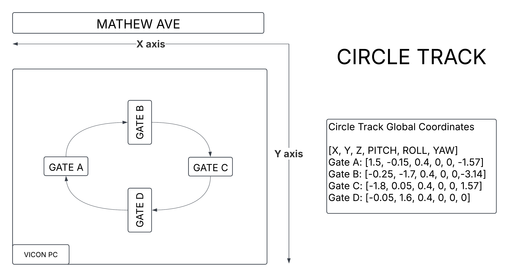
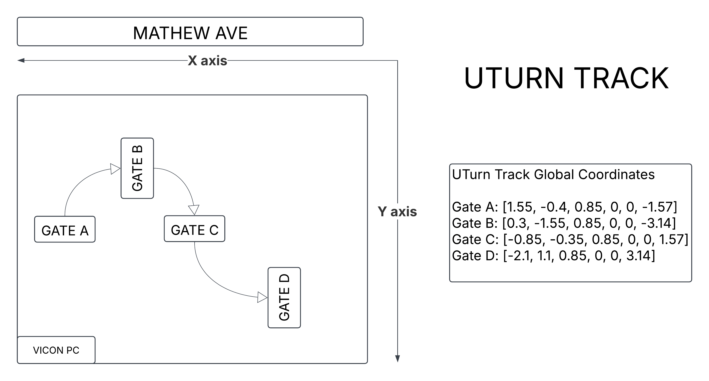

# FalconGym

### Contact Info: Yan Miao (yanmiao2@illinois.edu)

This repo provides a photorealistic simulation environment (FalconGym), that consists of 3 tracks, namely circle, U-turn and lemniscate (Figure-8). Each track consists of 4 gates arranged in different shapes.

For more details on FalconGym, please refere to our [paper](https://arxiv.org/abs/2503.02198). To cite it, you can use 
```
@misc{miao2025zeroshotsimtorealvisualquadrotor,
      title={Zero-Shot Sim-to-Real Visual Quadrotor Control with Hard Constraints}, 
      author={Yan Miao and Will Shen and Sayan Mitra},
      year={2025},
      eprint={2503.02198},
      archivePrefix={arXiv},
      primaryClass={cs.RO},
      url={https://arxiv.org/abs/2503.02198}, 
}
```

## Installation
1. Follow tutorial on [NeRFStudio](https://docs.nerf.studio/quickstart/installation.html) to install both Conda and NeRFStudio
2. Download the track configuration files from [Yan's Google Drive](https://drive.google.com/drive/folders/14IWE-GJ0t2qyS2GCGHhRHTpKWM0x6Jrh?usp=sharing) and place in specific folder hierachy
    - FalconGym/
        - scripts/ (from this github repo)
        - circle/
        - uturn/
        - lemniscate/
        - outputs/
3. To visually inspect the track, you could run
```
source ~/miniconda3/bin/activate
conda activate nerfstudio
ns-viewer --load-config outputs/circle/nerfacto/circle/config.yml
```
Then open the web GUI using the link printed in the terminal

## Scripts Explanation
1. `drone_dynamics.py`: Double integrator-based drone dynamics
    - Input: state (x, y, z, vx, vy, vz, yaw)  + control (ax, ay, az, yaw_rate)
    - Output: next state
    - Note: keep dt = 0.05s
    - Example: `python3 drone_dynamics.py`
2. `ns-renderer.py`: 
    - Input: camera pose (x, y, z, roll, pitch, yaw)
    - Output: RGB (640x480x3)
    - Note: Modify Track path accordingly
    - Example: `python3 scripts/ns_renderer.py` (note the file hierachy)
3. `ece484-gate-detection.py`:
    - Input: RGB (640x480x3)
    - Output: Mask (640x480)
4. `ece484-state-controller.py`:
    - Input: state (x, y, z, vx, vy, vz, yaw) + gate poses
    - Output: control (ax, ay, az, yaw_rate)
5. `ece484-vision-controller.py` 
    - Input: RGB (640x480x3)
    - Output: control (ax, ay, az, yaw_rate)
6.  `ece484-state-closed-loop.py`
    - Run `ece484-state-controller.py` in closed loop.
    - Output a trajectory txt
7.  `ece484-vision-closed-loop.py`
    - Run `ece484-state-controller.py` in closed loop.
    - Output an image folder and a trajectory txt
8.  `ece484-evaluate.py`


## Tasks for ECE 484 students
1. State-based Controller
    - Implement `ece484_state_controller.py` to finish 2 laps (8 gates) in each of the three tracks
    - Gate poses are in `gates_pos.txt`
    - Report Success Rate SR (% of gates you can cross), Mean-Gate-Error MGE (average distance to gate center when you cross a gate), Lap Time LP (=0.05 * # frames)
    - Yan's benchmark for circle track: 100% SR, 2.49cm MGE, 11s LP
2. Gate Detection
    - Implement `ece484-gate-detection.py`
    - You should demonstrate at least have around 100 images of different gates in different tracks (obtained from sampling using `ns-renderer.py`) where you can do gate detection perfectly through visual inspection. 
    - Yan's benchmark, Check `gate-detect-Yan-example/`
3. Localization / SLAM
    - You can free-style create or modify anything, the goal is to build on Task 2 to achieve:
        - Input: RGB Image
        - Output: gate relative pose to camera
    - Reference: [GateNet](https://github.com/open-airlab/GateNet)
4. Vision-Based Control
    - Implement `ece484_vision_controller.py`, using your intermediate results/knowledge from Task 2 and Task 


## Env Explanation

### 1. CIRCLE TRACK


### 2. UTURN TRACK


### 3. LEMNISCATE TRACK

