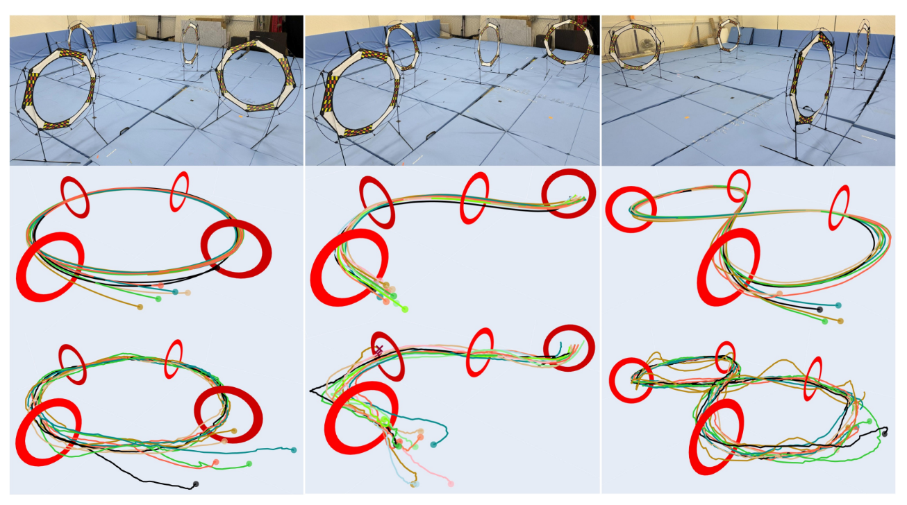
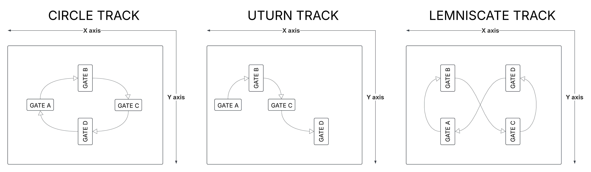

# FalconGym

### Contact Info: Yan Miao (yanmiao2@illinois.edu)

This repo provides a photorealistic simulation environment (FalconGym), that consists of 3 tracks, namely circle, U-turn and lemniscate (Figure-8). Each track consists of 4 gates arranged in different shapes.

For more details on FalconGym, please refere to our [paper](https://arxiv.org/abs/2503.02198) and [video](https://www.youtube.com/watch?v=TuTugNa39xs). 

Please refer the video link to get more detailed understanding [video](https://www.youtube.com/watch?v=TuTugNa39xs).

To cite it, you can use 
```
@misc{miao2025zeroshotsimtorealvisualquadrotor,
      title={Zero-Shot Sim-to-Real Visual Quadrotor Control with Hard Constraints}, 
      author={Yan Miao and Will Shen and Sayan Mitra},
      year={2025},
      eprint={2503.02198},
      archivePrefix={arXiv},
      primaryClass={cs.RO},
      url={https://arxiv.org/abs/2503.02198}, 
}
```
## Dependencies
    - python >= 3.8
    - PyTorch 2.1.2
    - CUDA 11.8
    - OpenCV
    - SciPy
    - Plotly

## Installation

1. Follow tutorial on [NeRFStudio](https://docs.nerf.studio/quickstart/installation.html) to install both Conda and NeRFStudio
2. To get started, clone this repository using Git:
```bash
git clone https://github.com/IllinoisReliableAutonomyGroup/FalconGym.git
cd FalconGym
pip install -r requirements.txt

```
3. Download the track configuration files from [Yan's Google Drive](https://drive.google.com/drive/folders/14IWE-GJ0t2qyS2GCGHhRHTpKWM0x6Jrh?usp=sharing) and place in specific folder hierachy
    - FalconGym/
        - scripts/ (from this github repo)
        - circle/
        - uturn/
        - lemniscate/
        - outputs/
4. To visually inspect the track, you could run
```
source ~/miniconda3/bin/activate
conda activate nerfstudio
ns-viewer --load-config outputs/circle/nerfacto/circle/config.yml
```
Then open the web GUI using the link printed in the terminal

## Scripts Explanation
1. `drone_dynamics.py`: Double integrator-based drone dynamics
    -Contains drone dynamics model
    - Input: state (x, y, z, vx, vy, vz, yaw)  + control (ax, ay, az, yaw_rate)
    - Output: next state
    - Note: keep dt = 0.05s
    - Example: `python3 drone_dynamics.py`

2. `ns-renderer.py`:  generates RGB images of the environment, useful for dataset creation.
    - Input: camera pose (x, y, z, roll, pitch, yaw)
    - Output: RGB (640x480x3)
    - Note: Modify Track path accordingly
    - Example: `python3 scripts/ns_renderer.py` (note the file hierachy)
    - Use this to get a 3d view of each environment, You can also create a training datset for gate detection

3. `ece484-gate-detection.py`: extracts gates from RGB images.
    - TODO Write gate detection algorithmn here.
    - Input: RGB (640x480x3)
    - Output: Mask (640x480)

4. `ece484-state-controller.py`: computes control commands based on state estimates.
    - TODO Write state controller algorithmn here. This script manages drone movements by controlling acceleration and yaw rate based on the current state of the drone.
    - Input: state (x, y, z, vx, vy, vz, yaw) + gate poses
    - Output: control (ax, ay, az, yaw_rate)

5. `ece484-vision-controller.py`:  computes control commands from first-person images.
    - TODO Write your vision controller algorithmn here. This script manages drone movements by controlling acceleration and yaw rate based on the fpv image of the drone.
    - Input: RGB (640x480x3)
    - Output: control (ax, ay, az, yaw_rate)

6.  `ece484-state-closed-loop.py`
    - No edits required, run this after finishing ece484_statecontroller.py. 
    - This script runs `ece484-state-controller.py` in closed loop. It simulates the drone's dynamics, and saves the trajectory to a text file.
    - Output: trajectory txt
    - Use this trajectory txt file for evaluating yourcontroller using [8]

7.  `ece484-vision-closed-loop.py`
    - This script uses gate detection algorithmn from `ece484-gate-detection.py` and vision controller from `ece484-vision-controller.py`. Complete both the scripts before running this
    -No edits are required in this script.
    - Run `ece484-state-controller.py` in closed loop.
    - Output an image folder, a trajectory txt file and a mp4 video 

8.  `ece484_evaluate.py`: computes metrics gate errors, time, and success rate.
    - Run `python3 ece484_evaluate.py --track-name Circle_Track --trajectory-path circle_traj.txt --visflag True --metricsflag True` take track name and trajectory txt file as arguments flags are optional. (make your trajectory.txt file by running 6 or 7)
    - mean gate error, mean time, success rate and Trajectory Visualization
    - outputs a metrics json file and plot of the trajectory.
    - refer to sample_results folder


## Tasks for ECE 484 students
1. State-based Controller
    - Implement `ece484_state_controller.py` to finish 2 laps (8 gates) in each of the three tracks
    - Gate poses are in `gates_pos.txt`
    - Run `ece484_state_closed_loop.py` to generate trajectory txt file
    - Report Success Rate SR (% of gates you can cross), Mean-Gate-Error MGE (average distance to gate center when you cross a gate), Lap Time LP (=0.05 * # frames) using ece484_evaluate.py script.
    - Yan's benchmark for circle track: 100% SR, 2.49cm MGE, 11s LP
2. Gate Detection
    - Implement `ece484-gate-detection.py`
    - Collect image dataset using ns-renderer.py
    - You should demonstrate at least have around 100 images of different gates in different tracks (obtained from sampling using `ns-renderer.py`) where you can do gate detection perfectly through visual inspection. 
    - Yan's benchmark, Check `gate-detect-Yan-example/`
3. Localization / SLAM
    - You can free-style create or modify anything, the goal is to build on Task 2 to achieve:
        - Input: RGB Image
        - Output: gate relative pose to camera
    - Reference: [GateNet](https://github.com/open-airlab/GateNet)
4. Vision-Based Control
    - Implement `ece484_vision_controller.py`, using your intermediate results/knowledge from Task 2 and Task 3
    - Run `ece484_vision_closed_loop.py` to generate trajectory txt file and video
    - Report Success Rate SR (% of gates you can cross), Mean-Gate-Error MGE (average distance to gate center when you cross a gate), Lap Time LP (=0.05 * # frames) using ece484_evaluate.py script.
  


## Env Explanation





## Submission Files
Please include the below information in your final submission.
1. 6 Trajectory.txt files 3 using State-based Controller for all 3 environments and 3 using Vision-based controller for all 3 environments
2. 6 metrics.json files 3 using State-based Controller for all 3 environments and 3 using Vision-based controller for all 3 environments


